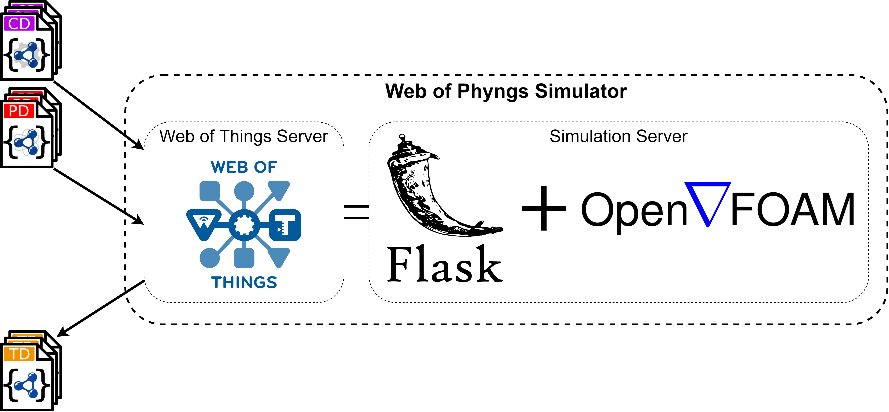
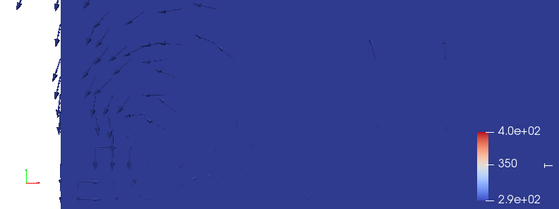

# WoT-Phyng-Sim

## Table of Contents

1. [Web of Things Simulations using CFD](#web-of-things-simulations-using-cfd)
2. [What can you do with WoT Phyngs Simulator](#what-can-you-do-with-wot-phyngs-simulator)
3. [Getting started](#getting-started)
- [Prerequisites](#prerequisites)
- [Starting the Simulator](#starting-the-simulator)
- [Setting up a Sample Simulation](#setting-up-a-sample-simulation)
- [Control the Things](#control-the-things)
- [Access the ParaView Server](#access-the-paraview-server)
4. [Best Practises](#best-practises)
5. [Errors and Known Problems](#errors-and-known-problems)
6. [Adding or Working on Issues](#adding-or-working-on-issues)

## Web of Things Simulations using CFD

Web of Phyngs is a synergy of [OpenFOAM](https://www.openfoam.com/) Computational Fluid Dynamics (CFD) simulator with Web of Things (WoT) that allows to simulate the Things inside the artificial physical environment.

To access OpenFOAM simulations during runtime, a python framework was build, which is accessible using [Flask-RESTful](https://flask-restful.readthedocs.io/en/latest/). The WoT server is consequetively running in parallel as a wrapper for the simulation server to enable Things interaction affordances. Web of Things framework is based on [node-wot](https://www.npmjs.com/org/node-wot), the reference implementation of [W3C's Scripting API](https://w3c.github.io/wot-scripting-api/).

Web of Phyngs proposes the extension of existing Thing Descriptions (TDs) with Case Descriptions (CDs) and Physical Thing Descriptions (PDs) to describe the simulation project and simulated Physical Things (Phyngs) accordingly. To simulate the Things, one should setup the environment with a CD and with PDs for the required Phyngs simulations. After setting things up, TDs would be produced and could be accessible in WoT server network and could be further used as regular Things.

## What can you do with WoT Phyngs Simulator

## Getting started

### Prerequisites

For quick starting with WoT Phyngs Simulator, make sure that you have Docker and Docker Compose installed:
  - Windows or macOS: [Install Docker Desktop](https://www.docker.com/get-started).
  - Linux: [Install Docker](https://www.docker.com/get-started) and then [Docker Compose](https://github.com/docker/compose).

If you want to visualize and/or analyze the simulated data, you might want to access the ParaView server where this could be done.

Make sure to install the ParaView with an appropriate version ([ParaView v5.6.0](https://www.paraview.org/download/)).

### Starting the Simulator

### Setting up a Sample Simulation

### Control the Things

### Access the ParaView Server

## Best Practises

## Errors and Known Problems

## Adding or Working on Issues

