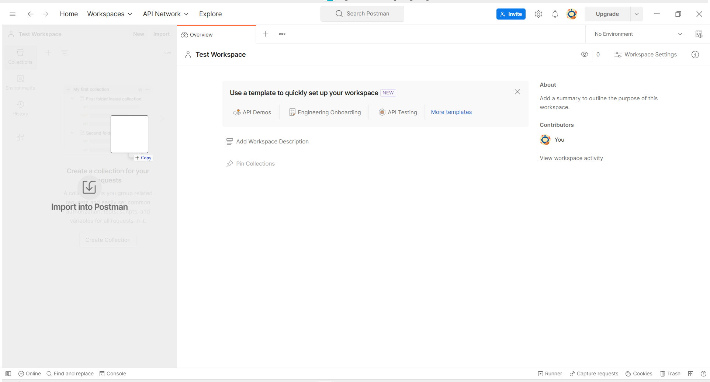
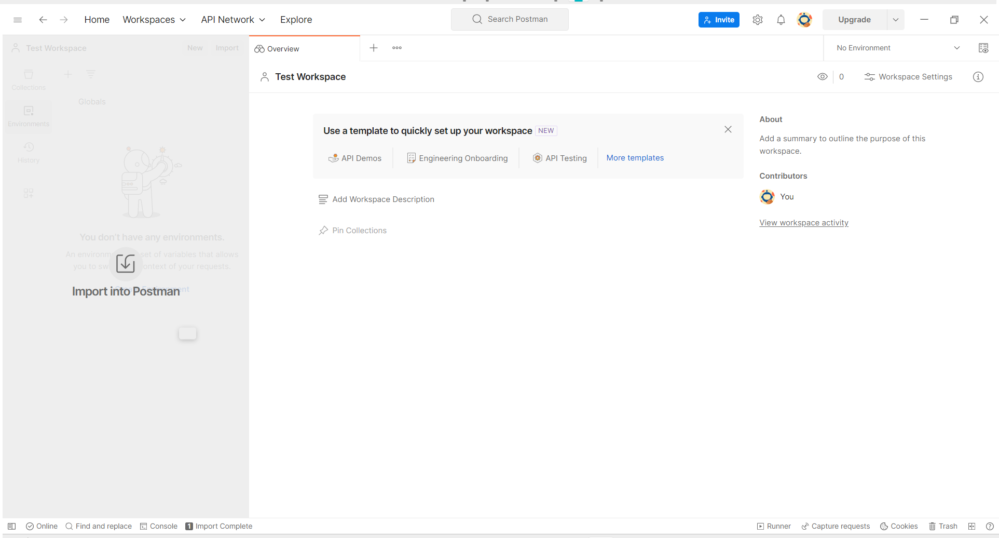
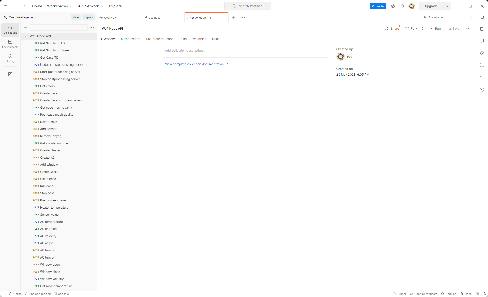
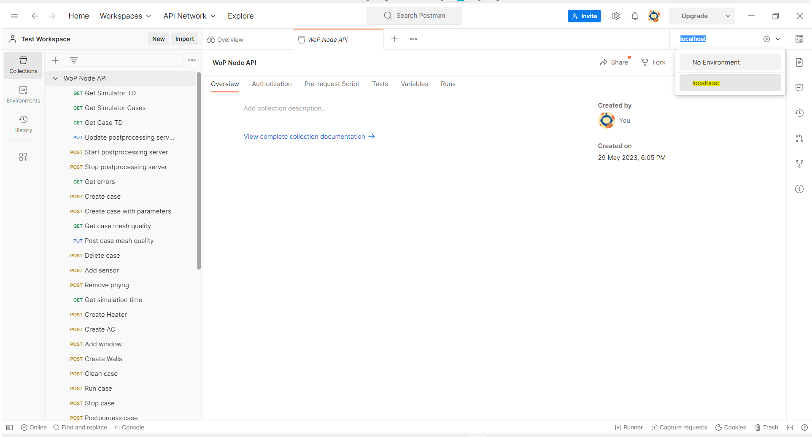
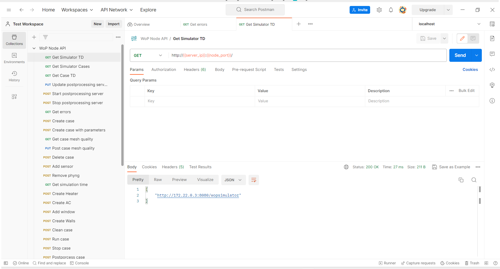
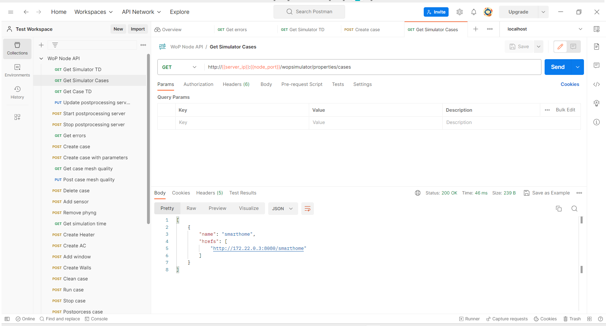
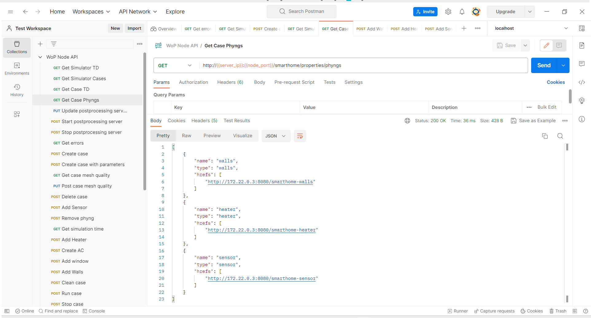
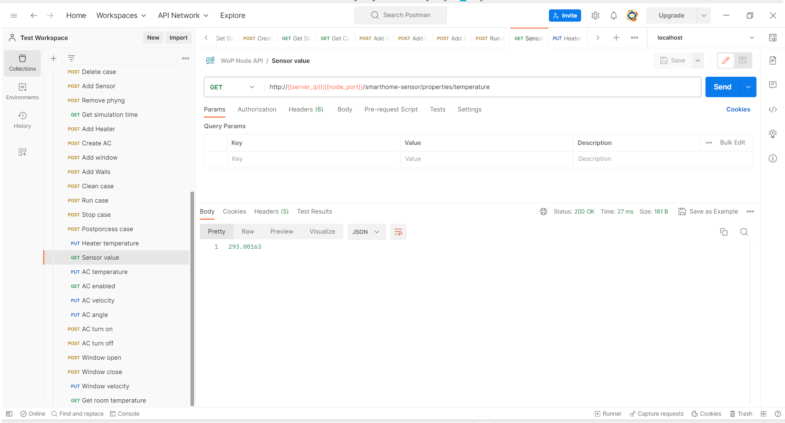
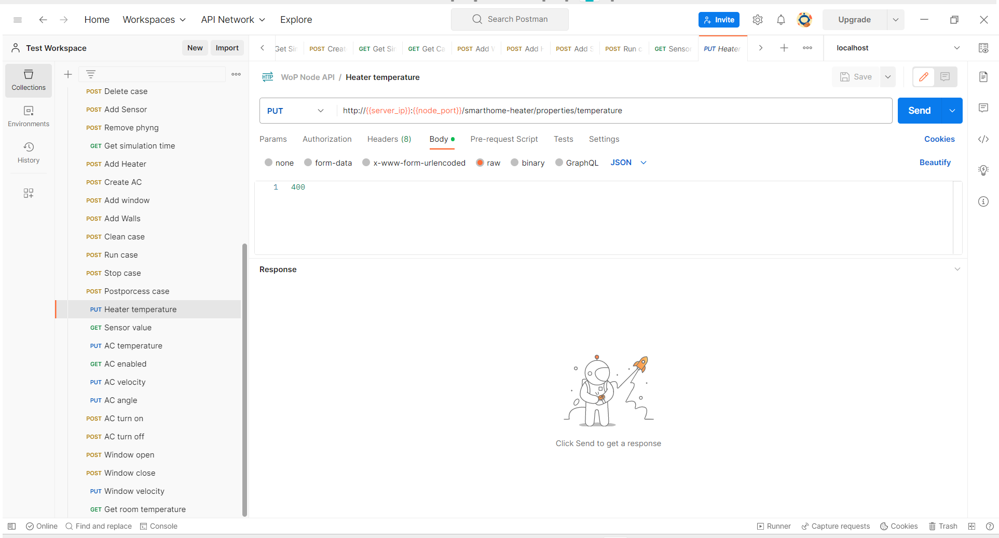
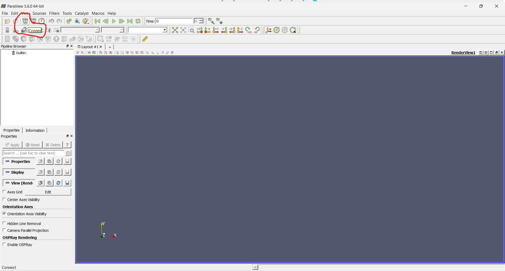

# WoT-Phyng-Sim

## Table of Contents

1. [Web of Things Simulations using CFD](#web-of-things-simulations-using-cfd)
2. [What can you do with WoT Phyngs Simulator](#what-can-you-do-with-wot-phyngs-simulator)
3. [Getting started](#getting-started)
    - [Prerequisites](#prerequisites)
    - [Installing from sources](#installing-from-sources)
    - [Starting the Simulator](#starting-the-simulator)
    - [Setting up a Sample Simulation](#setting-up-a-sample-simulation)
    - [Control the Things](#control-the-things)
    - [Access the ParaView Server](#access-the-paraview-server)
4. [Best Practises](#best-practises)
5. [Errors and Known Problems](#errors-and-known-problems)
6. [Adding or Working on Issues](#adding-or-working-on-issues)
    - [Adding Issues](#adding-issues)
    - [Working on Issues](#working-on-issues)

## Web of Things Simulations using CFD

Web of Phyngs is a synergy of [OpenFOAM](https://www.openfoam.com/) Computational Fluid Dynamics (CFD) simulator with Web of Things (WoT) that allows to simulate the Things inside the artificial physical environment.

To access OpenFOAM simulations during runtime, a python framework was build, which is accessible using [Flask-RESTful](https://flask-restful.readthedocs.io/en/latest/). The WoT server is consequetively running in parallel as a wrapper for the simulation server to enable Things interaction affordances. Web of Things framework is based on [node-wot](https://www.npmjs.com/org/node-wot), the reference implementation of [W3C's Scripting API](https://w3c.github.io/wot-scripting-api/).

Web of Phyngs proposes the extension of existing Thing Descriptions (TDs) with Case Descriptions (CDs) and Physical Thing Descriptions (PDs) to describe the simulation project and simulated Physical Things (Phyngs) accordingly. To simulate the Things, one should setup the environment with a CD and with PDs for the required Phyngs simulations. After setting things up, TDs would be produced and could be accessible in WoT server network and could be further used as regular Things.


## What can you do with WoT Phyngs Simulator

- Construct your own custom physical simulation environment for testing your IoT devices
- Add your things into the simulation
- Run your simulation in "near-realtime" and interract with your devices as if they were real
- Run your simulation in a regular mode and post-process the results
- Visualize and analyze the data in the post-run

## Getting started

### Prerequisites

For quick starting with WoT Phyngs Simulator, make sure that you have Docker and Docker Compose installed:
  - Windows or macOS: [Install Docker Desktop](https://www.docker.com/get-started).
  - Linux: [Install Docker](https://www.docker.com/get-started) and then [Docker Compose](https://github.com/docker/compose).

If you want to visualize and/or analyze the simulated data, you might want to access the ParaView server where this could be done.

Make sure to install the ParaView with an appropriate version ([ParaView v5.6.0](https://www.paraview.org/download/)).

### Installing from sources

**Step 1:** Clone the repository to your local machine.

```console
git clone https://github.com/tum-esi/WoT-Phyng-Sim.git
```

**Step 2:** Navigate into the main folder and build the containers.

```console
cd WoT-Phyng-Sim
docker-compose build
```

### Starting the Simulator

After buidling the containers, start the simulation in normal or detached modes:

Normal mode:

```console
docker-compose up
```

Detached mode:

```console
docker-compose up -d
```

### Setting up a Sample Simulation

We will use Postman to show the easiest example with.

**Step 1:** Enter your workspace where you would want to export the collections or create a new one.

**Step 2:** Add the sample collection, which is stored in [evaluation folder](evaluation)/[WoT-Phyng-Sim.postman_collection.json](evaluation/WoT-Phyng-Sim.postman_collection.json).



**Step 3:** Add the sample environment, which is stored in [evaluation folder](evaluation)/[localhost.postman_environment.json](evaluation/localhost.postman_environment.json). Set it up if needed.



**Step 4:** Verify the collection and environment, they should look similiar to the screenshots below:




**Step 5:** Select the used environment.



**Step 6:** Try to `Get Simulator TD`, The response should be of a similiar look:



If the response is OK, then the server connection is established.

The response body gives the paths to simulator Thing Description and can be used to interract with it using WoT Scripting API directly.

**Step 7:** Create a test simulation case using `Create Case` POST request to the wopsimulator. The response should be OK with an empty body. If everything went well, then you could view the existing cases using `Get Simulator Cases` request:



The `hrefs` of each case display the path to their corresponding Thing Description and can be used to interract with them using WoT Scripting API directly.

**Step 8:** Add Walls, Heater and a Sensor with corresponding commands. You can verify if the phyngs were added to the case with `Get Case Phyngs` request:



The `hrefs` of each phyng display the path to their corresponding Thing Description and can be used to interract with them using WoT Scripting API directly.

**Step 9:** Now that the simulation case is preliminary set up, one case start the case by sending `Run case` request. The simulator will then prepare the simulation case by mapping the objects into the mesh and setting up the files. The case is setup to run with 50% mesh quality with 1 core, the end time of 10 seconds and in "realtime". 

You can later stop the case simulation by sending `Stop case` request.

### Control the Things

You can read the properties of devices and invoke actions during the simulation run, e.g., read the temperature or set the heater temperature.

For that, you can use the requests provided in the example: GET `Sensor value`, PUT `Heater temperature`. The latter command would set the temperature of the heater to 400 K.





### Access the ParaView Server

Once the case simulation is done (stopped), you can post-process the results and view them using ParaView.

**Step 1:** Post-process the case using `Postprocess case` request.
**Step 2:** Start ParaView and select `Connect`:



**Step 3:** Add Server, in this example the host is `localhost` and the password is `11111`, also set a name for your server.

**Step 4:** After the server is connected, you can see it being added in the left panel.


**Step 5:** You can now use ParaView as if it was a local ParaView instance. The tutorial on how to work with it is out of scope of this documentation. But once everything is setup, you will be able to visualize and analyze your data as shown in the example screenshot below:


## Best Practices

- Do not use too low of a mesh quality, the data might not be usable or the case would not be even created (depends on the objects complexity/amount).
- Do not use too high of a mesh quality if you want to achieve the "realtime" and lack the resourceful server. The simulator is currently build on OpenFOAM version that utilizes CPU, not GPU. Hence, even the most powerful PC builds might not handle "realtime" in some "simple" cases.
- Be realistic about the simulation geometric boundaries and do not put Phyngs outside the enclosed space (walls).
- Windows, doors and other flat surfaces must lay exactly on some other surface, i.e., walls. When using custom STLs, it is even more complex to fulfill this.
- Keep in mind that the using high quality STL and a coarse mesh would not bring much results. Sometimes it might give more problems while setting up.

## Errors and Known Problems

- Simulation might collapse occasionally if the simulation/Phyngs parameters do not match well, e.g.
    - Bad mesh quality choice
    - Phyngs are placed outside the bounding mesh (e.g., walls)
    - Phyngs placement close to each other (might result in meshes of Phyngs to merge)
    - Too many Phyngs are added (depends on the simulation)
    - etc.
- Custom STLs do not always work as expected, i.e., not always rendered properly
- Custom STLs with complex geometry might not be properly rendered to a lower mesh quality simulation (e.g., sometimes lower mesh quality results in STLs being rendered with holes inside them)
- New Things added to the WoP Simulator with the same name will result in enumeration of consequentally added Things (e.g., added `walls` in the first simulation case will result in `walls` name of a Thing, but adding `walls` to the second simulation case will result in `walls2` Thing name and so one)

The problems can be detected by directly reading the `/errors` path of the server(-s) and/or observed by the simulation not progressing in time. However, the latter alone might also indicate that simulation case is complex and takes time to process. On possible solution is clean the simulation and try playing with parameters.

## Adding or Working on Issues

### Adding Issues

When adding a new issue, please...

1) Use the following **title style**:

    ```
    [<Topic>] <short description of issue>
    ```
    E.g.: [Python] Improve simulation speed

2) Add a **priority label** to indicate the importance of the issue.   

    Existing priority labels are: 
      - prio-low
      - prio-mid
      - prio-high.

3) Add a label indicating the **type** of the issue.   

    Existing type labels are: 
    - Bug
    - Enhancement (A new feature or functionality)
    - Improvement (Improvement of existing features/ functionality)

4) Add it to an **Overview-Ticket** (that fits best)  
    Existing overview-tickets are: 
    - [[NodeJS]](https://github.com/tum-esi/WoT-Phyng-Sim/issues/2)
    - [[Python]](https://github.com/tum-esi/WoT-Phyng-Sim/issues/3)
    - [[ParaView]](https://github.com/tum-esi/WoT-Phyng-Sim/issues/4)
    - [[Misc]](https://github.com/tum-esi/WoT-Phyng-Sim/issues/5)

### Working on Issues

When you want to work on an issue, please ... 

1) Assign issue to yourself: So that multiple persons aren't working on the same issue.

2) Create a new branch, and use the following naming convention:   
    ```
    <type-of-issue>-<topic>-<short-description>
    ```
    _type-of-issue_ refers to this:   
    E.g. _bugfix-server-crash-on-start_ or _improvement-updated-thing-models_

3) Link the according issue in the pull request: When finishing the issue and when creating a pull-request to master, link the issue. The person who merges the pull-request to master can then close the issue.

4) Closed issue also needs to be striked-through on the according overview-issue.
